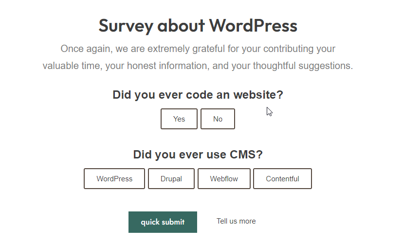

#### AP Survey for GravityForms


1. Install GravityForms + Install this plugin
- nothing will change untill you add form fields (Survey fields)
- plugin will change look & feel for Radio buttons



3. Must add ready class names to Form:
```ap-survey-for-gf```

4. Add class name to conditional button (Read More, Tell us more)
```ap-survey-conditional```
- set fields conditional to this field (radio, checkbox)
- this will move button after submit button